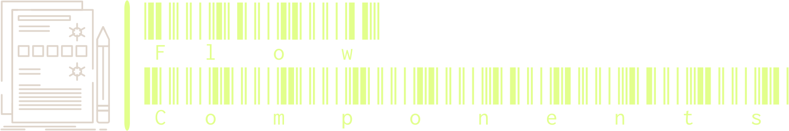
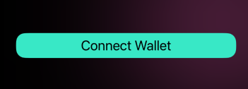
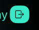
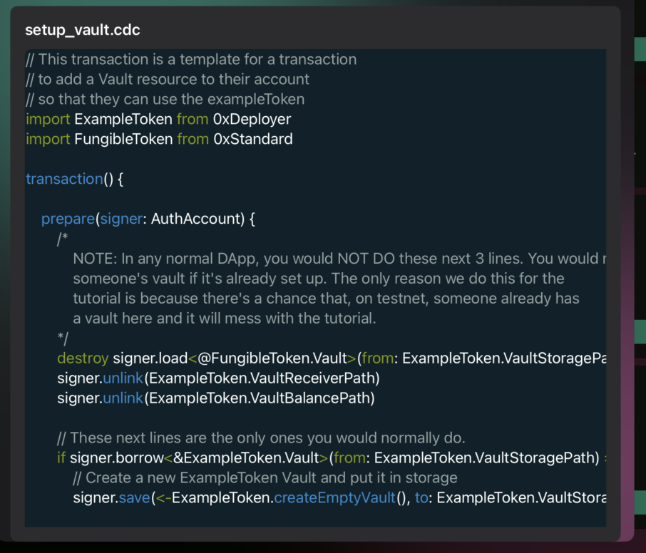
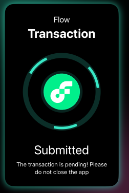
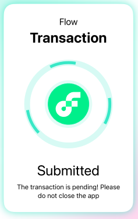

<!-- Improved compatibility of back to top link: See: https://github.com/othneildrew/Best-README-Template/pull/73 -->

<a name="readme-top"></a>

<!--
*** Thanks for checking out the Best-README-Template. If you have a suggestion
*** that would make this better, please fork the repo and create a pull request
*** or simply open an issue with the tag "enhancement".
*** Don't forget to give the project a star!
*** Thanks again! Now go create something AMAZING! :D
-->

<div align="center">

<!-- PROJECT SHIELDS -->
<!--
*** I'm using markdown "reference style" links for readability.
*** Reference links are enclosed in brackets [ ] instead of parentheses ( ).
*** See the bottom of this document for the declaration of the reference variables
*** for contributors-url, forks-url, etc. This is an optional, concise syntax you may use.
*** https://www.markdownguide.org/basic-syntax/#reference-style-links
-->

[![Contributors][contributors-shield]][contributors-url]
[![Forks][forks-shield]][forks-url]
[![Stargazers][stars-shield]][stars-url]
[![Issues][issues-shield]][issues-url]
[![MIT License][license-shield]][license-url]

<br />

<a href="https://github.com/Forge4Flow/FlowComponents">
  
</a>

<br />

<p align="center">
  Reusable SwiftUI views, modifiers, and extensions for creating DApps on the Flow Blockchain.
  <!-- <br />
  <a href="https://github.com/Forge4Flow/FlowComponents"><strong>Explore the docs »</strong></a> -->
  <br />
  <br />
  <!-- <a href="https://github.com/Forge4Flow/FlowComponents">View Demo</a>
  · -->
  <a href="https://github.com/Forge4Flow/FlowComponents/issues">Report Bug</a>
  ·
  <a href="https://github.com/Forge4Flow/FlowComponents/issues">Request Feature</a>
</p>
</div>

<!-- GETTING STARTED -->

## Getting Started

### Installation

To add `FlowComponents` to your Xcode project:

1. Open your Xcode project.
2. Navigate to `File` -> `Swift Packages` -> `Add Package Dependency...`.
3. Enter the repository URL: `https://github.com/Forge4Flow/FlowComponents.git`.
4. Choose the version you want to use.
5. Add the package to your desired targets.

### Themeing

> More details to come, with better theme support being developed.

The components all currently support a basic global theme with the below configuration options:

```swift
public var primaryColor: SwiftUI.Color
public var secondaryColor: SwiftUI.Color
public var tertiaryColory: SwiftUI.Color
public var textMateTheme: Themes
```

Updating the theme colors is as simple as providing a new `ThemeConfig` to the `flowManager`

```swift
flowManager.themeConfig = ThemeConfig(primaryColor: Color.eaPrimary, secondaryColor: Color.eaSecondary, tertiaryColory: Color.eaTertiary)
```

### Components / Views

#### `ButtonView`

A standard SwiftUI button with common view modifiers applied to create a traditional looking button.

```swift
ButtonView(title: "Connect Wallet") {
    fcl.openDiscovery()
}

or

ButtonView {
    Image(systemName: "rectangle.portrait.and.arrow.forward")
        .foregroundStyle(Color.black)
        .padding(10)
} action: {
    Task {
        try await fcl.unauthenticate()
    }
}
.frame(maxWidth: 20)
```

<div align="center">
  
  
</div>

#### `CodeBlock`

A customizable code block with TextMate syntax highlighting support

```swift
CodeBlock(code: <String>, grammar: <GrammarTypes>, theme: <Themes>)
```

<div align="center">
  
</div>

##### `CadenceCode`

`CadenceCode` is a helper protocal for defining reusable sets of cadence code. You can use this within the `CodeBlock` or FCL when running scripts/transactions

For example you can create a enum that confirms to `CadenceCode` allowing for type safe re-using of your cadence code throughout the application.

```swift
import Foundation
import FlowComponents

enum Transactions: CadenceCode {
    case setupVault
    case transfer

    var fileName: String {
        switch self {
        case .setupVault:
            return "setup_vault.cdc"
        case .transfer:
            return "transfer.cdc"
        }
    }

    var code: String {
        switch self {
        case .setupVault:
            return """
            // This transaction is a template for a transaction
            // to add a Vault resource to their account
            // so that they can use the exampleToken
            import ExampleToken from 0xDeployer
            import FungibleToken from 0xStandard

            transaction() {

                prepare(signer: AuthAccount) {
                    /*
                        NOTE: In any normal DApp, you would NOT DO these next 3 lines. You would never want to destroy
                        someone's vault if it's already set up. The only reason we do this for the
                        tutorial is because there's a chance that, on testnet, someone already has
                        a vault here and it will mess with the tutorial.
                    */
                    destroy signer.load<@FungibleToken.Vault>(from: ExampleToken.VaultStoragePath)
                    signer.unlink(ExampleToken.VaultReceiverPath)
                    signer.unlink(ExampleToken.VaultBalancePath)

                    // These next lines are the only ones you would normally do.
                    if signer.borrow<&ExampleToken.Vault>(from: ExampleToken.VaultStoragePath) == nil {
                        // Create a new ExampleToken Vault and put it in storage
                        signer.save(<-ExampleToken.createEmptyVault(), to: ExampleToken.VaultStoragePath)

                        // Create a public capability to the Vault that only exposes
                        // the deposit function through the Receiver interface
                        signer.link<&ExampleToken.Vault{FungibleToken.Receiver}>(ExampleToken.VaultReceiverPath, target: ExampleToken.VaultStoragePath)

                        // Create a public capability to the Vault that only exposes
                        // the balance field through the Balance interface
                        signer.link<&ExampleToken.Vault{FungibleToken.Balance}>(ExampleToken.VaultBalancePath, target: ExampleToken.VaultStoragePath)
                    }
                }
            }
            """
        case .transfer:
            return """
            import ExampleToken from 0xDeployer
            import FungibleToken from 0xStandard

            transaction(recipient: Address, amount: UFix64) {
                let SenderVault: &ExampleToken.Vault
                let ReceiverVault: &ExampleToken.Vault{FungibleToken.Receiver}

                prepare(signer: AuthAccount) {
                    // Get a reference to the signer's stored vault
                    self.SenderVault = signer.borrow<&ExampleToken.Vault>(from: ExampleToken.VaultStoragePath)
                        ?? panic("Could not borrow reference to the owner's Vault!")

                    self.ReceiverVault = getAccount(recipient).getCapability(ExampleToken.VaultReceiverPath)
                                            .borrow<&ExampleToken.Vault{FungibleToken.Receiver}>()
                                            ?? panic("The recipient does not have an ExampleToken Vault set up.")
                }

                execute {
                    let vault: @FungibleToken.Vault <- self.SenderVault.withdraw(amount: amount)
                    // Deposit the withdrawn tokens in the recipient's receiver
                    self.ReceiverVault.deposit(from: <- vault)
                }
            }
            """
        }
    }
}

// You can then use the code with FCL or within a `CodeBlock`
try await fcl.mutate(cadence: Transactions.setupVault.code)

CodeBlock(cadenceCode: Transactions.setupVault)
```

#### `IPFSImage`

a Cached AsyncImage view for images stored on IPFS. Currently supports pulling images from <https://nftstorage.link>, with additional providers coming in the future.

```swift
IPFSImage(cid: nft.thumbnail["url"] ?? "")
    .frame(width: 300)
```

#### `TransactionView`

A popup view for showing transaction status, simply pass the transaction ID to `flowManager.subscribeTransaction` as shown, the view will automatically pop up on the screen, track the transaction status and disappear upon completion. If the transaction fails the detail will be passed to `ErrorView` below.

```swift
do {
    let id = try await fcl.mutate(cadence: Transactions.setupVault.code)

    flowManager.subscribeTransaction(txId: id)
} catch {
    print(error)
}
```

<div align="center">
  
  
</div>

#### `ErrorView`

> More details to come

### Responsive DApp Helper

> More details to come

<!-- #### `AppProperties` -->

<p align="right">(<a href="#readme-top">back to top</a>)</p>

<!-- USAGE EXAMPLES -->

<!-- ROADMAP -->

## Roadmap

- [ ] README Updates/Documentation
- [ ] Better Themeing Capabilities
- [ ] Additional Components

See the [open issues](https://github.com/Forge4Flow/FlowComponents/issues) for a full list of proposed features (and known issues).

<p align="right">(<a href="#readme-top">back to top</a>)</p>

<!-- CONTRIBUTING -->

## Contributing

The open source community thrives on contributions, and yours can make a real difference. If you're eager to share your ideas or enhancements, our Discord server is the place to be. Here's how you can contribute:

1. [Join our Discord](https://discord.gg/z7GCDeVhYG) server for discussions and support.
2. Fork the Project on GitHub.
3. Create your Feature Branch (`git checkout -b feature/YourAmazingFeature`).
4. Commit your Changes (`git commit -m 'Add YourAmazingFeature'`).
5. Push to the Branch (`git push origin feature/YourAmazingFeature`).
6. Open a Pull Request and discuss it with us on Discord.

We value each contribution and encourage you to connect with us on Discord to brainstorm and collaborate. Don't forget to star the project on GitHub!

<p align="right">(<a href="#readme-top">back to top</a>)</p>

<!-- LICENSE -->

## License

Distributed under the MIT License. See `LICENSE` for more information.

<p align="right">(<a href="#readme-top">back to top</a>)</p>

<!-- CONTACT -->

## Contact

Connect with us directly on our Discord server for any queries or collaborations. You can also reach out to BoiseITGuru on Twitter or via email, but for faster responses and a more interactive experience, our Discord community is the best place to be.

- Join our Discord: [Discord Server Invite Link](https://discord.gg/z7GCDeVhYG)
- BoiseITGuru Twitter: [@boiseitguru](https://twitter.com/boiseitguru)
- Email: boiseitguru@forge4flow.com

For more about Forge4Flow, visit [https://docs.forge4flow.com](https://docs.forge4flow.com).

<p align="right">(<a href="#readme-top">back to top</a>)</p>

<!-- ACKNOWLEDGMENTS -->

## Acknowledgments

Our library owes its existence to several key influences and resources in the open source community:

- **Inspiration from Emerald City DAO**: The initial inspiration for our library comes from the [Emerald City DAO: Svelte Components Library](https://github.com/EmeraldCityDAO/svelte-components).
- **Utilized Open Source Libraries**: We built our components on top of various open source libraries. These include:
  - [SyntaxHighlight](https://github.com/Forge4Flow/SyntaxHighlight.git)
  - [SwiftUI Cached Async Image](https://github.com/lorenzofiamingo/swiftui-cached-async-image)
  - [FCL-Swift](https://github.com/outblock/fcl-swift)

This section is an opportunity to show gratitude to those who have indirectly helped shape this project. We invite you to explore these resources and acknowledge their contributions to the open source community.

<p align="right">(<a href="#readme-top">back to top</a>)</p>

<!-- MARKDOWN LINKS & IMAGES -->
<!-- https://www.markdownguide.org/basic-syntax/#reference-style-links -->

[contributors-shield]: https://img.shields.io/github/contributors/Forge4Flow/FlowComponents.svg?style=for-the-badge
[contributors-url]: https://github.com/Forge4Flow/FlowComponents/graphs/contributors
[forks-shield]: https://img.shields.io/github/forks/Forge4Flow/FlowComponents.svg?style=for-the-badge
[forks-url]: https://github.com/Forge4Flow/FlowComponents/network/members
[stars-shield]: https://img.shields.io/github/stars/Forge4Flow/FlowComponents.svg?style=for-the-badge
[stars-url]: https://github.com/Forge4Flow/FlowComponents/stargazers
[issues-shield]: https://img.shields.io/github/issues/Forge4Flow/FlowComponents.svg?style=for-the-badge
[issues-url]: https://github.com/Forge4Flow/FlowComponents/issues
[license-shield]: https://img.shields.io/github/license/Forge4Flow/FlowComponents.svg?style=for-the-badge
[license-url]: https://github.com/Forge4Flow/FlowComponents/blob/main/LICENSE
